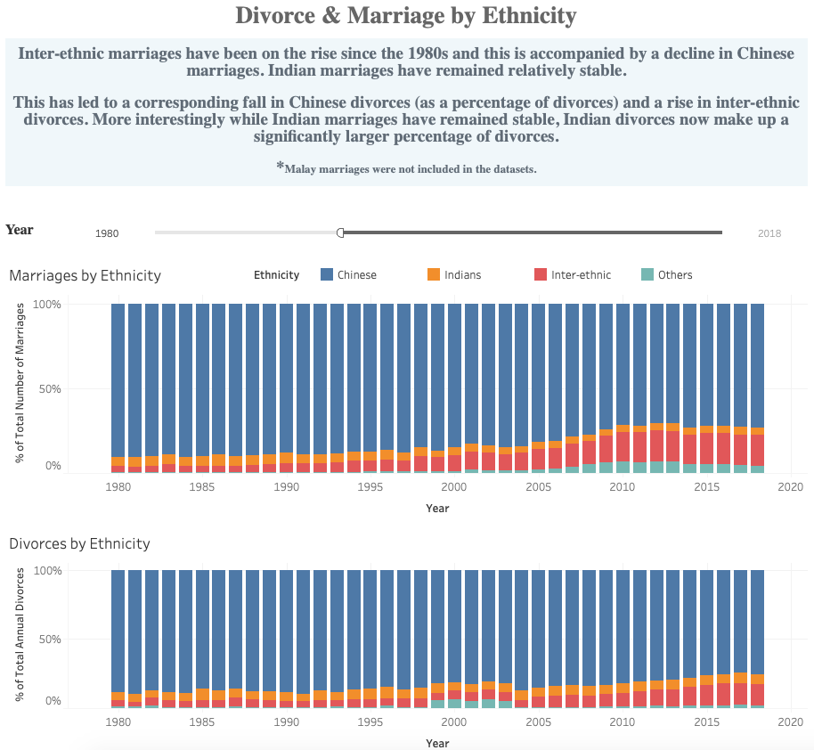

# Divorce Trends in Singapore

We first explore divorce trends in the global context before delving deeper onto divorce trends in Singapore. I want to explore divorce rates in Singapore by ethnicity, gender and finally age. There are a total of 4 interactive dashboards. 
[Click here to checkout the entire interactive dashboard](https://public.tableau.com/views/DivorceTrendsinSingapore/DivorceMarriageTrends?:display_count=y&:origin=viz_share_link)

1. `.twb` : is the desktop workbook file.

## Dashboard Preview

