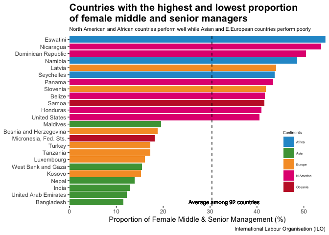
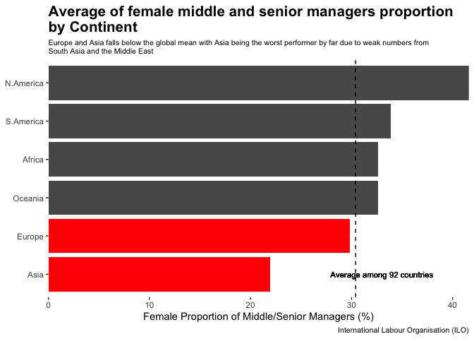
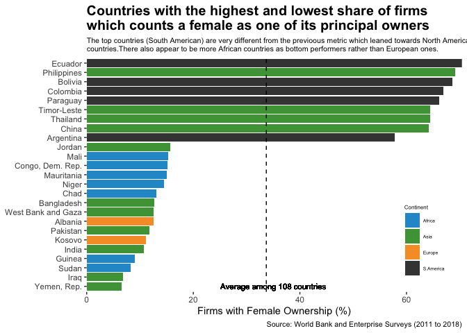
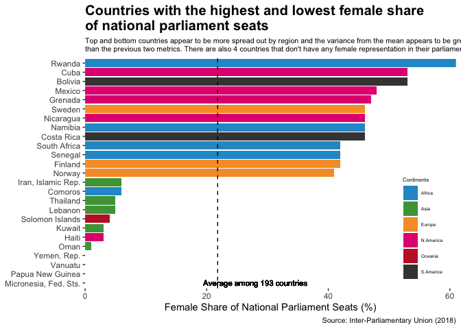

Gender Equality Trends
================
Dominic Teo

Introduction
------------

The fight for gender equality has often found its most important battlegrounds to be in national parliaments, middle and senior management of private firms as well as in ownership groups of firms. [Studies](https://www.vox.com/2016/7/27/12266378/electing-women-congress-hillary-clinton) have shown that women members of national parliaments are more likely to introduce legislation that benefits women hence are an important part in the fight to getting rid of institutional gender inequality. On the other hand, the gender glass ceiling and gender wage gaps in private companies are not only another obstacle in the gender equality movement but is also a drag on economic growth. Research conducted at the [Booth School of Business](https://www.sciencedaily.com/releases/2018/08/180822150812.htm) have found that women continue to face resistance in joining the upper echelons of private companies.

It is clear that increasing female representation in national parliaments and in the upper echelons of private firms is an important metric of gender equality. However, it is also apparent that progress in these areas have not been even across the world. Hence, the purpose of this analysis is threefold: Firstly, this analysis will seek to identify regional trends to determine which Continents are doing well and which are faring poorly in increasing female representation in the different arenas. Secondly, this analysis will also attempt to identify any relationship between female representation in national parliaments, middle and senior management as well as ownership of firms to get a better idea if countries that score highly in one metric will score highly in another metric. Finally, this analysis will try to use these three areas of female representation as predictor variables for predicting a general gender equality score hence evaluating which predictor variable appears to be more important.

Regional Trends
---------------

### Female Share of Senior & Middle Management

The average proportion of female middle & senior managers among 92 countries is 30.4%. North American countries perform well in this metric with not only the highest average at 41.61% but with several countries such as Nicaragua, Panama and the US falling within the top 12 countries. African countries also perform "surprisingly" well with Eswatini taking the top spot and the African continent has the third highest average at 32.64%. European countries perform surprisingly poorly in this metric and this is across developed countries such as Luxembourg who ranks 85 out of 92 countries as well as developing countries such as Kosovo. Lastly, the Asian continent ranks last with an average that is far below the mean. Other than Europe, only Asia lies below the mean. Asian countries in South Asia such as Bangladesh, India and Nepal performs exceptionally poor.

### Female Share of Firm Ownership

### Female Share of National Parliamentary Seats

Relationship between the different metrics
------------------------------------------

Now, I would like to dig deeper to better understand the three different metrics in order to get a more complete picture of understanding progress in gender equality around the world. The goal of this is to **identify if countries that score highly in one metric will score highly in another metric**. I believe that this is extremely important as **countries often use good performance in one metric to herald progress in gender equality efforts which I believe presents a distorted and incomplete picture.**

I first look at the relationship between female share of national parliamentary seats and female share of senior and middle management positions. We have 90 countries that have data on both metrics and as can be seen in the below graph, there is little correlation between the two metrics despite it being reasonable to assume a positive relationship between the two. This implies that countries with a high proportion of females in middle/senior management position does not imply a high female share of national parliamentary seats and vice versa.

I think that the incredibly low R Squared score is actually quite suprising hence I want to dig deeper into understanding why the R squared score is so low. Hence I re-did the scatter plot but this time by Continents. As can be seen the lack of correlation is not consistent across Continents. There is a significant negative correlation between the two metrics for South American countries and to a lesser extent Asian countries. On the other hand, there is a positive correlation between the two metrics for Oceanic and North American countries. A negative correlation implies that countries with a high female share of national parliamentary seats actually have lower share of middle/senior management positions or vice versa.

Regarding female share of national parliamentary seats and firm ownership, there appears to be a higher positive correlation between the two metrics than the previous two metrics as can be seen by the higher R Squared score. There are 105 different countries that had data on both metrics.

