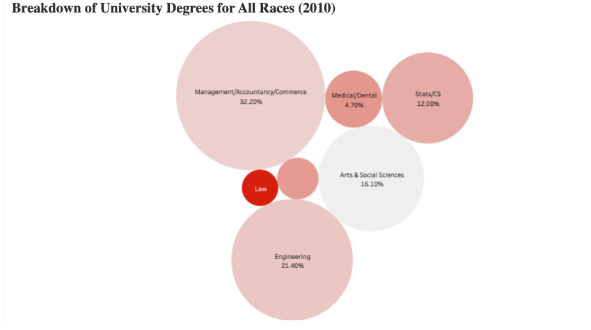

# Racial Inequality in Educational Outcomes (Singapore)

Meritocracy has become an integral aspect of the Singaporean identity and the Singaporean dream, however, I believe that it causes policy-makers and Singaporeans alike to play down racial inequalities in educational outcomes in Singapore. My goal is to demonstrate that Malays, relative to other ethnic groups in Singapore, are badly under-represented in higher (tertiary education) though improvements have been made. I will also show that inequalities in educational outcomes are exacerbated by the fact that Malay university students are severly under-represented in higher paying degrees. 
[Click here to checkout the entire interactive dashboard](https://public.tableau.com/profile/dominic.teo#!/vizhome/RacialInequalityinEducationalOutcomesSingapore/Dashboard1)

1. `.twb` : is the desktop workbook file.

## Dashboard Preview

